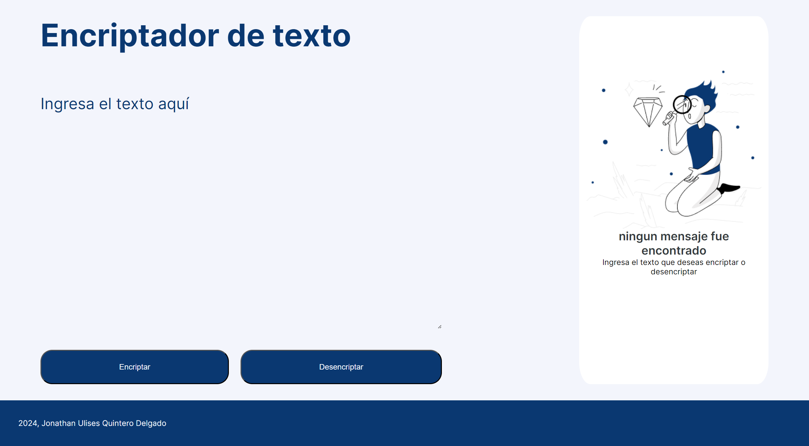

# Encriptador de Texto

Este proyecto es una aplicación web que permite encriptar y desencriptar textos utilizando un conjunto de reglas específicas. La interfaz es sencilla y fácil de usar, permitiendo a los usuarios interactuar con las funciones de encriptación y desencriptación, así como copiar los resultados al portapapeles.

## Desarrollado por
Jonathan Ulises Quintero Delgado

## Características

- **Encriptación y Desencriptación**: Convierte texto plano en texto encriptado y viceversa usando reglas específicas.
- **Interfaz de Usuario Amigable**: Incluye un área de texto para entrada y salida de texto, botones de acción, y mensajes de advertencia para entradas inválidas.
- **Compatibilidad**: Funciona en dispositivos de escritorio, tabletas y móviles.

## Reglas de Encriptación

- `e` se convierte en `enter`
- `i` se convierte en `imes`
- `a` se convierte en `ai`
- `o` se convierte en `ober`
- `u` se convierte en `ufat`

Solo se procesan letras minúsculas y no se admiten letras con acentos ni caracteres especiales.

## Requisitos

- Navegador moderno con soporte para HTML5, CSS3, y JavaScript.

## Instalación

1. **Clonar el repositorio**:
    ```bash
    git clone https://github.com/usuario/proyecto-encriptador.git
    ```
2. **Navegar al directorio del proyecto**:
    ```bash
    cd proyecto-encriptador
    ```

3. **Abrir el archivo `index.html` en un navegador**:
    Puedes abrir el archivo directamente en un navegador web para ver y probar la aplicación.

## Uso

1. **Encriptar Texto**:
   - Escribe o pega el texto que deseas encriptar en el área de texto.
   - Haz clic en el botón "Encriptar".
   - El texto encriptado aparecerá en el área de resultado.

2. **Desencriptar Texto**:
   - Escribe o pega el texto encriptado en el área de texto.
   - Haz clic en el botón "Desencriptar".
   - El texto desencriptado aparecerá en el área de resultado.

3. **Copiar Texto**:
   - Haz clic en el botón "Copiar" para copiar el texto en el área de resultado al portapapeles.

## Capturas de pantalla
   - Al ejecutar el encriptador de texto:


## Contribuciones

Las contribuciones son bienvenidas. Por favor, sigue las siguientes pautas para contribuir al proyecto:

1. Haz un fork del repositorio.
2. Crea una nueva rama con tu funcionalidad o corrección de errores.
3. Realiza tus cambios y asegúrate de probarlos.
4. Envía un pull request detallando los cambios realizados.


---

¡Gracias por usar el encriptador de texto!